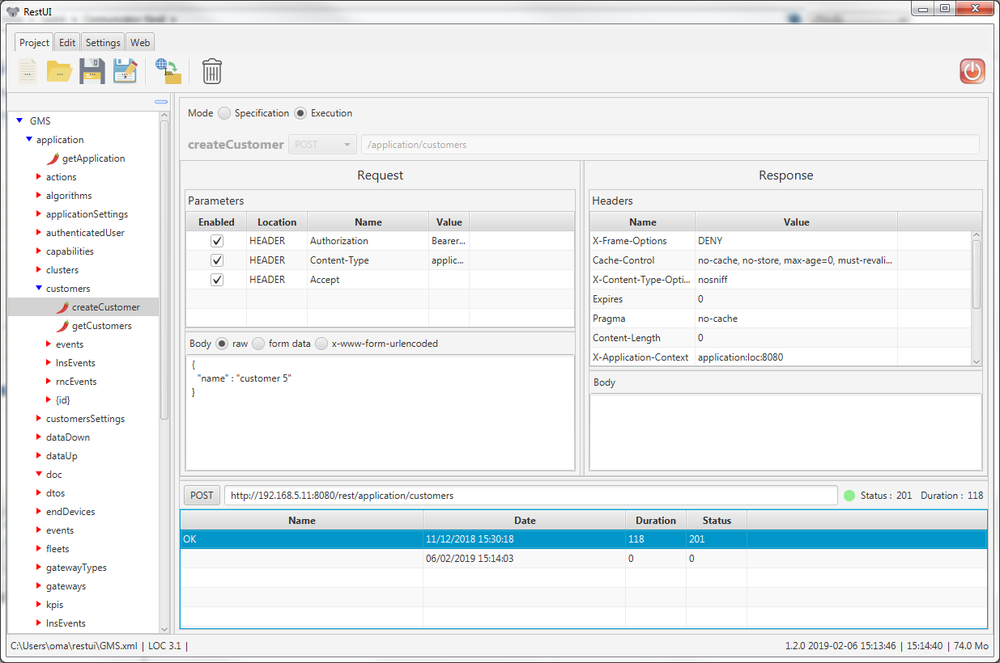

# rest-ui
<span style="color:green">REST client application</span>



With rest-ui you can execute HTTP requests and analyse the responses sent by the server.

Your REST endpoints are modelized and stored in a tree in a XML file.

All the exchanges (request / response) are saved in a XML file.


## Commands
``` ./gradlew nativeCompile ```

fr.ikisource.restui.gui.restuiapp.o is created and can be found under build/gluonfx/x86_64-linux/gvm/tmp/SVM-*/

``` ./gradlew nativeLink ```

It produces the native image under /media/DATA/dev/rest-ui/build/gluonfx/x86_64-linux/

``` ./gradlew nativePackage ```

<span style="color:red">To be completed ...</span>